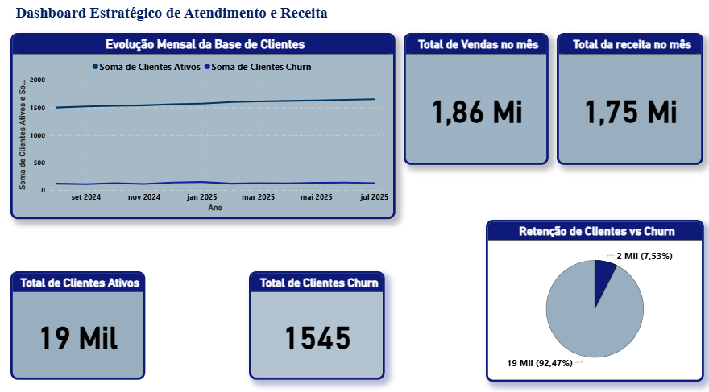
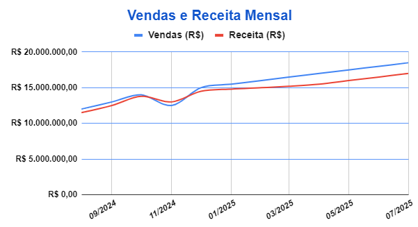
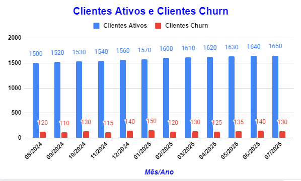

📊 "Dashboard Interativo – Vendas, Receita e Churn (Google Sheets & Power BI)"

## 🚀 Sobre o Projeto
Transformamos dados brutos em insights estratégicos!  
Este projeto apresenta dashboards interativos, KPIs automatizados e relatórios claros, permitindo que gestores e analistas tomem decisões rápidas e assertivas.  

Ideal para quem deseja monitorar vendas, receitas e churn de forma prática e visual.

## 🎯 Objetivos
- 📈 Acompanhar vendas e receitas mês a mês.  
- 👥 Monitorar clientes ativos e churn.  
- ⚡ Avaliar KPIs de desempenho de vendas.  
- 🎨 Criar painéis claros, impactantes e simples de interpretar.

## 🛠 Tecnologias & Ferramentas
- **Excel / Planilhas Google** – Organização de dados e design de KPIs  
- **Power BI Desktop** – Visualização interativa e relatórios dinâmicos  
- **PDF / PNG** – Exportação de painéis e gráficos  
- **GitHub** – Versionamento e apresentação profissional do projeto

## 📁 Estrutura do Repositório

dashboard-vendas-churn1/
├─ README.md
├─ data/
│ └─ vendas_clientes.xlsx
├─ dashboards/
│ └─ dashboard_vendas.pdf
├─ scripts/
│ └─ calculos_kpi.md
├─ reports/
│ └─ analise_performance.pdf
├─ images/
│ ├─ grafico_linhas.png
│ ├─ grafico_colunas.png
│ ├─ grafico_pizza.png
│ └─ dashboard_powerbi.png
└─ powerbi/
└─ dashboard-vendas-churn1.pbix

## 💻 Power BI

### Como abrir
[Baixar o Power BI Dashboard](powerbi/dashboard-vendas-churn1.pbix)  
Abra no **Power BI Desktop** (versão recente recomendada)

### Exportações (opcional)
Para pré-visualização, você pode exportar como PDF ou PNG:  
- Salve como `powerbi/relatorio_powerbi.pdf` e/ou `powerbi/relatorio_powerbi.png`

### Observações
- O relatório usa o tema padrão do Power BI  
- Alterações manuais em cores ou visuais não afetam os demais gráficos

### Imagem do Dashboard

## ✨ Benefícios
- ✅ Visualização clara de métricas essenciais  
- ✅ Insights acionáveis para otimização de vendas  
- ✅ Fácil compartilhamento com a equipe  
- ✅ Projeto pronto para apresentação a gestores ou clientes

## 🖼 Imagens do Dashboard
  
  
 

🔗 [Link da planilha no Google Sheets](https://docs.google.com/spreadsheets/d/1-Za4L6qdfn-9oKUnzzgsvc8Y6RVUXrGaua5ne9--6b4/edit?gid=0#gid=0)

📌 Nota  
Este repositório é uma demonstração profissional de análise de dados e dashboards interativos, ideal para portfólio ou apresentação corporativa.
